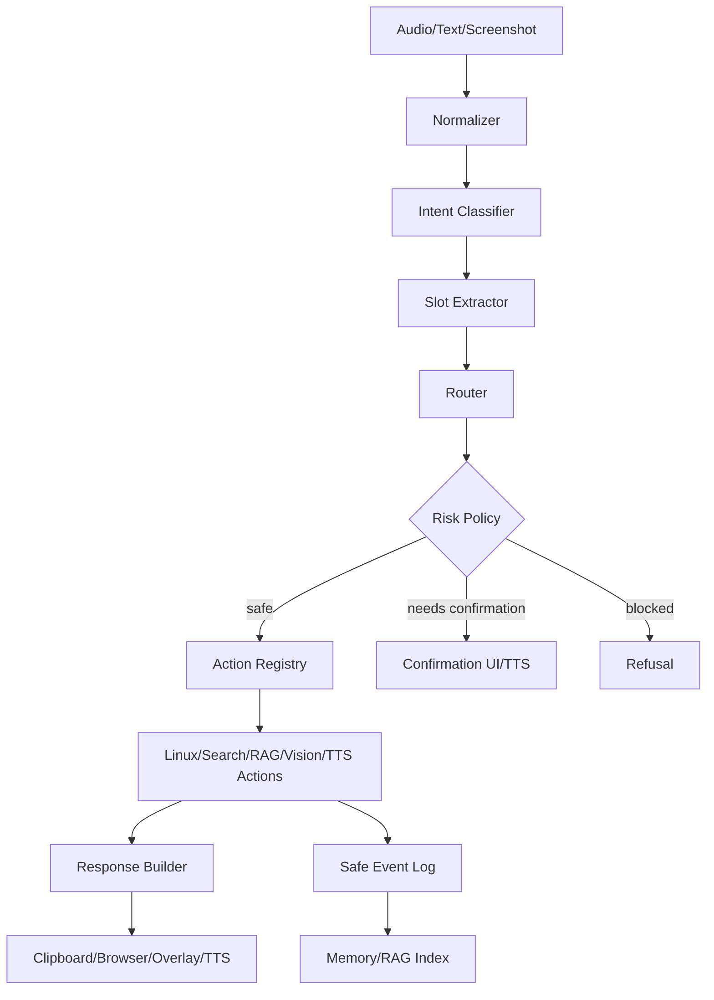

# Arquitetura do Assistente VisionClip

## Visão Geral

O VisionClip deve evoluir de um serviço de screenshot com IA para um assistente Linux local, multimodal e seguro. A arquitetura separa três responsabilidades:

- **Cognição**: normalização, classificação de intents, extração de slots, decisão estruturada e geração de resposta.
- **Execução**: action registry validado, handlers determinísticos em Rust e integrações Linux.
- **Contexto**: tela, voz, busca web, memória local, RAG e histórico seguro.

O LLM planeja e explica, mas não executa comandos diretamente. Toda ação passa pelo registry e por política de risco.

## Diagrama



## Fluxo Ponta a Ponta

1. Capturar entrada por voz, texto ou tela.
2. Normalizar texto, idioma e ruído de ASR/OCR.
3. Classificar intent e extrair slots.
4. Gerar `AgentDecision` em JSON estruturado.
5. Validar decisão contra `ActionSpec`.
6. Avaliar risco, permissões e necessidade de confirmação.
7. Executar handler Rust determinístico.
8. Montar resposta curta ou explicativa.
9. Copiar, abrir navegador, falar via TTS ou renderizar overlay.
10. Registrar evento seguro, sem segredos nem conteúdo sensível desnecessário.

## Módulos Principais

| Módulo | Responsabilidade |
| --- | --- |
| `audio` | captura, VAD, buffers, cancelamento |
| `asr` | faster-whisper, whisper.cpp, Vosk ou API externa |
| `tts` | Piper HTTP, fila de fala, interrupção |
| `intent` | taxonomia e contratos de classificação |
| `router` | decisão estruturada, confirmação e política |
| `actions` | registry, schemas, timeouts e handlers |
| `linux` | `.desktop`, `gtk-launch`, `xdg-open`, portal, D-Bus |
| `search` | provedores, snippets, extração permitida e citações |
| `vision` | screenshot, OCR, DOM permitido, acessibilidade |
| `rag` | ingestão, chunking, embeddings, retriever e reranker |
| `memory` | sessão, preferências, histórico e expiração |
| `security` | níveis de risco, allowlists, sandbox e auditoria |

## Intents

| Intent | Slots principais | Risco padrão | Ação típica |
| --- | --- | --- | --- |
| `OpenApplicationIntent` | `app_name`, `launch_mode` | 1 | `open_application` |
| `SearchWebIntent` | `query`, `max_results` | 0 | `search_web` |
| `AskKnowledgeIntent` | `question`, `topic` | 0 | `explain_topic` ou `search_web` |
| `ExplainSearchResultIntent` | `query`, `source_context` | 2 se capturar tela | `capture_screen_context` + `explain_search_context` |
| `ReadScreenIntent` | `mode` | 2 | `capture_screen_context` |
| `SummarizeScreenIntent` | `mode`, `focus` | 2 | `capture_screen_context` |
| `SystemCommandIntent` | `command_id`, `args` | 3 | `run_safe_command` |
| `FileSearchIntent` | `query`, `paths` | 2 | `search_files` |
| `ClarificationIntent` | `question` | 0 | resposta ao usuário |
| `UnknownIntent` | `raw_text` | 0 | fallback seguro |

## Router

O router recebe `IntentDetection` e produz `AgentDecision`. Decisões devem ser JSON válido e conter apenas resumo curto de raciocínio, nunca chain-of-thought.

```json
{
  "intent": "OpenApplication",
  "confidence": 0.94,
  "requires_action": true,
  "requires_confirmation": false,
  "risk_level": 1,
  "slots": {
    "app_name": "vscode"
  },
  "proposed_action": {
    "name": "open_application",
    "arguments": {
      "app_name": "vscode"
    }
  },
  "user_response": "Abrindo o VS Code.",
  "reasoning_summary": "O usuário pediu para abrir um aplicativo instalado."
}
```

## Action Registry

Cada ação deve declarar:

- nome, descrição e handler Rust;
- nível de risco e permissões;
- schemas de entrada e saída;
- timeout e retry;
- política de confirmação;
- logs seguros.

O registry inicial está em `visionclip-common::actions` e inclui `open_application`, `search_web`, `capture_screen_context`, `speak_text` e `run_safe_command`.

## Abertura de Aplicativos Linux

Estratégia recomendada:

1. Indexar `/usr/share/applications` e `~/.local/share/applications`.
2. Ler `Name`, `GenericName`, `Exec`, `Keywords` e `Categories`.
3. Aplicar aliases locais: `vscode -> code`, `terminal -> x-terminal-emulator`, `navegador -> firefox/chromium/default`.
4. Rankear por similaridade textual e, futuramente, embeddings.
5. Confirmar se houver ambiguidade.
6. Abrir por `gtk-launch` quando houver desktop id; usar `xdg-open` para URLs; evitar shell arbitrário.

## Busca Web

O Google pode ser usado quando HTML útil estiver disponível, mas o sistema não deve depender exclusivamente dele. O pipeline deve suportar provedores configuráveis, APIs oficiais e fallback HTML permitido.

Fluxo:

1. Gerar query limpa.
2. Buscar resultados.
3. Rankear por confiabilidade e relevância.
4. Extrair conteúdo permitido.
5. Gerar resposta com fontes.
6. Falar resumo curto e oferecer aprofundamento.

## Google/Gemini Visível na Tela

O VisionClip não deve burlar CAPTCHA, autenticação ou bloqueio técnico. Quando o usuário pedir para explicar o resultado visível:

- capturar apenas conteúdo visível na sessão do usuário;
- preferir acessibilidade/DOM permitido;
- usar screenshot + OCR local quando necessário;
- identificar blocos de AI Overview como fonte auxiliar;
- validar com fontes orgânicas ou primárias quando possível;
- informar que a síntese veio do conteúdo visível.

Estrutura de contexto:

```json
{
  "query": "Quem foi Rousseau?",
  "provider": "google_visible_screen",
  "organic_results": [],
  "ai_overview_text": null,
  "ai_overview_sources": [],
  "visible_text": "",
  "captured_at": "2026-04-25T12:00:00Z",
  "confidence": 0.0,
  "source_urls": [],
  "extraction_method": "screenshot_ocr"
}
```

## RAG e Memória

RAG deve combinar BM25 e embeddings. Um caminho pragmático é SQLite para metadados, Tantivy para busca textual e Qdrant/LanceDB para vetores.

Memória permitida:

- preferências explícitas;
- aplicativos instalados e aliases;
- histórico de intents sem dados sensíveis;
- buscas anteriores com expiração;
- documentos locais autorizados pelo usuário.

Não salvar senhas, tokens, chaves, conteúdo privado capturado da tela sem consentimento ou comandos perigosos.

## Segurança

| Nível | Política |
| --- | --- |
| 0 | resposta, explicação, TTS |
| 1 | abrir app ou URL |
| 2 | ler tela, criar/mover arquivo simples, acessar documentos autorizados |
| 3 | shell restrito, instalar pacote, permissões, alterações de sistema |
| 4 | bloqueado por padrão: exfiltração, captura de segredos, bypass de segurança |

Regras:

- LLM nunca executa shell.
- LLM só propõe ações estruturadas.
- Registry valida ação, risco e schema.
- Risco 2+ exige confirmação.
- Risco 4 é recusado por padrão.
- Todo handler tem timeout.

## Plano de Fases

1. **Contratos**: intents, action registry, `AgentDecision`, schemas e testes.
2. **Open apps**: indexador `.desktop`, aliases, fuzzy ranking e `gtk-launch`.
3. **Router local**: regras rápidas para intents comuns antes de LLM.
4. **LLM router**: prompt estruturado com validação de JSON e fallback.
5. **Voz baixa latência**: VAD real, streaming ASR e cancelamento de TTS.
6. **Screen context**: acessibilidade/portal/OCR e contexto estruturado.
7. **RAG**: memória local, ingestão, busca híbrida e políticas de expiração.
8. **Permissões UI**: painel de permissões, histórico e modo privado.

## Riscos Técnicos

| Risco | Mitigação |
| --- | --- |
| Atalho global varia entre GNOME/KDE/Wayland | script por desktop, fallback e logs |
| Google bloqueia scrape local | provedores alternativos, APIs oficiais e leitura da tela do usuário |
| ASR impreciso em ambiente ruidoso | VAD, melhor microfone, modelo maior opcional e confirmação |
| LLM propõe ação perigosa | action registry, risk policy e allowlist |
| Latência alta | daemon residente, modelos pré-carregados, cache e pipeline concorrente |
