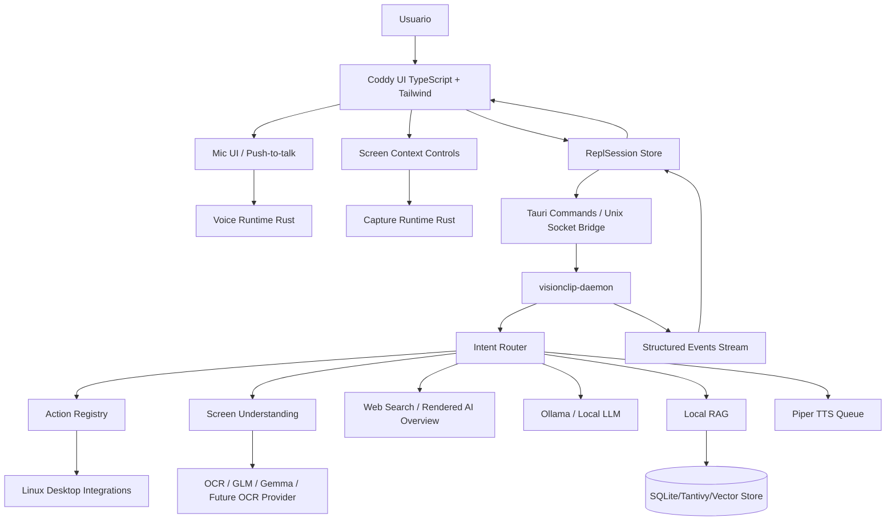

# Arquitetura do Coddy REPL

## Visão Geral

O **Coddy** deve ser uma camada de interação persistente entre usuário, tela, voz, modelos locais e ações do sistema. Ele não substitui o daemon atual do VisionClip; ele o orquestra.

Arquitetura proposta:



## Componentes Principais

### `apps/coddy`

Novo app Tauri recomendado para o modo desktop app e para o binário `coddy`.

Responsabilidades:

- Criar janelas desktop: `main`, `floating-terminal`, `settings`, `model-manager`.
- Registrar atalhos do app quando ativo e delegar o atalho global ao broker/fallback do desktop.
- Conectar UI TypeScript com o daemon.
- Encapsular permissões nativas.
- Controlar transparência, blur, always-on-top e focus behavior.

### Atalho Global e Listener Residente

O atalho de voz não deve depender da janela principal estar aberta. O Coddy precisa de um caminho residente e observável:

```text
GNOME/Tauri shortcut -> coddy voice --overlay -> CoddyShortcutBroker -> visionclip-daemon -> overlay listening -> ASR -> router
```

Componentes:

- `coddy voice --overlay`: comando leve instalado em `~/.local/bin`, acionado pelo bind do desktop.
- `CoddyShortcutBroker`: mediador com lock de sessão ativa, responsável por decidir se inicia, ignora, cancela ou substitui uma execução.
- `VoiceOverlay`: janela transparente always-on-top que aparece antes do ASR iniciar, com estado `listening`, `transcribing`, `thinking`, `speaking` e `error`.
- `coddy doctor shortcuts`: diagnóstico de bind, comando instalado, permissões, sessão GNOME, variáveis `DISPLAY`, `WAYLAND_DISPLAY` e `DBUS_SESSION_BUS_ADDRESS`.

MVP recomendado:

- O bind do GNOME chama `coddy voice --overlay`.
- O comando cria um lock não bloqueante em `XDG_RUNTIME_DIR/visionclip/coddy-voice.lock`.
- Se não houver sessão ativa, mostra overlay e envia `VoiceTurn` ao daemon.
- Se houver sessão ativa, aplica `ShortcutConflictPolicy`.
- A evolução posterior pode manter um broker residente via `systemd --user`, mas o contrato externo do comando permanece o mesmo.

```rust
pub enum ShortcutConflictPolicy {
    IgnoreWhileBusy,
    StopSpeakingAndListen,
    CancelRunAndListen,
}

pub enum ShortcutDecision {
    StartListening { run_id: RunId },
    IgnoredBusy { active_run_id: RunId },
    StoppedSpeaking { previous_run_id: RunId, next_run_id: RunId },
    CancelledRun { previous_run_id: RunId, next_run_id: RunId },
    Failed { reason: String },
}
```

Estratégia Linux:

- GNOME/Kali/Ubuntu/Debian: instalar bind via `gsettings org.gnome.settings-daemon.plugins.media-keys custom-keybindings`.
- App Tauri residente: registrar atalho via plugin quando disponível, mas manter GNOME Media Keys como fallback.
- Conflito de atalho: detectar quando o bind não chama o comando e sugerir tecla alternativa.
- Logs: gravar cada acionamento em `~/.local/state/visionclip/coddy-shortcut.log` com `run_id`, binding, comando e resultado.
- Concorrência: se houver voz/TTS/execução ativa, o segundo acionamento deve cancelar, pausar ou ignorar conforme preferência, nunca iniciar duas falas simultâneas.

Critério mínimo: pressionar o atalho configurado deve abrir a overlay em estado `listening` antes de qualquer chamada ao modelo.

### Superfície de Comandos `coddy`

O binário `coddy` deve ser a entrada de alto nível para REPL, voz e assistência técnica. Ele não deve substituir `visionclip`, que continua sendo o cliente direto de captura/ações. A diferença esperada:

- `visionclip`: comando operacional direto para screenshot, OCR, tradução, explicação, busca e abertura de apps/sites.
- `coddy`: sessão conversacional, histórico, contexto, políticas, UI e fluxos agentic.

Comandos propostos:

```bash
coddy                         # abre modo desktop app ou última UI usada
coddy repl                    # abre terminal flutuante
coddy ask "explique esse erro"
coddy screen explain          # captura tela e explica
coddy screen code             # captura tela e analisa código visível
coddy screen choice           # captura tela e extrai questão/opções
coddy voice                   # push-to-talk com overlay
coddy models                  # lista modelos locais e status
coddy doctor                  # diagnóstico específico do REPL/UI
coddy doctor shortcuts        # valida bind, comando, ambiente gráfico e último acionamento
coddy shortcuts install       # instala/repara bind global do desktop
coddy shortcuts test          # simula acionamento e valida overlay/listening sem falar com LLM
coddy settings                # abre configurações
```

Todos esses comandos devem gerar `ReplCommand` estruturado e passar pelo daemon ou pelo core Rust, nunca por shell arbitrário.

### `crates/coddy-core`

Crate Rust com domínio independente de UI.

Responsabilidades:

- Estado de sessão.
- Tipos de eventos.
- Tipos de mensagens.
- Políticas de assessment.
- Contratos de intents do REPL.
- Builders de contexto.
- Serialização/validação.

Proposta de módulos:

```text
crates/coddy-core/src/
  lib.rs
  session.rs
  event.rs
  command.rs
  assessment.rs
  context.rs
  policy.rs
  prompt.rs
  telemetry.rs
```

### `apps/coddy/src`

Frontend TypeScript + Tailwind.

Responsabilidades:

- Renderizar modo simples e advanced.
- Manter store local de UI.
- Exibir streaming de tokens/eventos.
- Suportar entrada por texto e voz.
- Gerenciar seleção de modelo.
- Exibir contexto da tela, arquivos e histórico.
- Enviar comandos estruturados ao backend.

Sugestão de stack:

- Vite
- React
- TypeScript
- TailwindCSS
- xterm.js
- Monaco Editor
- Zustand ou reducer próprio para UI state
- Vitest + Testing Library
- Playwright

## Modos de UI

### Modo Simples: Floating Terminal

Baseado em:

- `repl_ui/floating_terminal_coding_interaction/code.html`
- `repl_ui/floating_terminal_model_selection/code.html`

Características:

- Janela flutuante.
- Fundo transparente configurável.
- `backdrop-filter` com blur.
- Input terminal-like.
- Ícone de microfone.
- Seletor rápido de modelo.
- Resposta streaming estilo agent CLI.
- Baixa fricção: abrir, perguntar, responder, fechar.

Casos de uso:

- Dúvidas rápidas.
- Perguntas sobre tela.
- Explicar erro visível.
- Pedir dica durante estudo.
- Selecionar modelo local/cloud.

### Modo Advanced: Desktop App

Baseado em:

- `repl_ui/repl_main_view/code.html`
- `repl_ui/agentic_execution_mode/code.html`
- `repl_ui/context_workspace/code.html`
- `repl_ui/local_model_manager/code.html`
- `repl_ui/configuration_settings_modal/code.html`

Características:

- Sidebar fixa.
- Painel de conversa.
- Workspace de contexto.
- Gerenciador de modelos.
- Execução agentic com plano e autorização.
- Console de logs.
- Configuração de provedores, modelos, voz, privacidade e políticas.

Casos de uso:

- Sessões longas.
- Análise de projeto.
- Depuração com vários arquivos.
- RAG local.
- Monitoramento de modelos.
- Assistência em coding practice.

## Modelo de Sessão

```rust
pub struct ReplSession {
    pub id: SessionId,
    pub mode: ReplMode,
    pub status: SessionStatus,
    pub policy: AssistancePolicy,
    pub selected_model: ModelRef,
    pub voice: VoiceState,
    pub screen_context: Option<ScreenContext>,
    pub workspace_context: Vec<ContextItem>,
    pub messages: Vec<ReplMessage>,
    pub active_run: Option<RunId>,
}
```

```rust
pub enum ReplMode {
    FloatingTerminal,
    DesktopApp,
}

pub enum SessionStatus {
    Idle,
    Listening,
    Transcribing,
    CapturingScreen,
    BuildingContext,
    Thinking,
    Streaming,
    Speaking,
    AwaitingConfirmation,
    Error,
}
```

## Eventos

O daemon deve emitir eventos granulares, não apenas resposta final.

```rust
pub enum ShortcutSource {
    GnomeMediaKeys,
    TauriGlobalShortcut,
    Cli,
    SystemdUserService,
}

pub enum ReplEvent {
    SessionStarted { session_id: SessionId },
    ShortcutTriggered { binding: String, source: ShortcutSource },
    OverlayShown { mode: ReplMode },
    VoiceListeningStarted,
    VoiceTranscriptPartial { text: String },
    VoiceTranscriptFinal { text: String },
    ScreenCaptured { source: CaptureSource, bytes: usize },
    OcrCompleted { chars: usize, language_hint: Option<String> },
    IntentDetected { intent: ReplIntent, confidence: f32 },
    PolicyEvaluated { policy: AssistancePolicy, allowed: bool },
    ModelSelected { model: ModelRef, role: ModelRole },
    SearchStarted { query: String, provider: String },
    SearchContextExtracted { provider: String, organic_results: usize, ai_overview_present: bool },
    TokenDelta { run_id: RunId, text: String },
    ToolStarted { name: String },
    ToolCompleted { name: String, status: ToolStatus },
    TtsQueued,
    TtsStarted,
    TtsCompleted,
    RunCompleted { run_id: RunId },
    Error { code: String, message: String },
}
```

## Intents do REPL

```rust
pub enum ReplIntent {
    AskTechnicalQuestion,
    ExplainScreen,
    ExplainCode,
    DebugCode,
    SolvePracticeQuestion,
    MultipleChoiceAssist,
    GenerateTestCases,
    ExplainTerminalError,
    SearchDocs,
    OpenApplication,
    OpenWebsite,
    ConfigureModel,
    ManageContext,
    AgenticCodeChange,
    Unknown,
}
```

## Comandos Estruturados

```rust
pub enum ReplCommand {
    Ask {
        text: String,
        context_policy: ContextPolicy,
    },
    CaptureAndExplain {
        mode: ScreenAssistMode,
        policy: AssessmentPolicy,
    },
    VoiceTurn {
        transcript_override: Option<String>,
    },
    OpenUi {
        mode: ReplMode,
    },
    SelectModel {
        model: ModelRef,
        role: ModelRole,
    },
    StopActiveRun,
    StopSpeaking,
}

pub enum ScreenAssistMode {
    ExplainVisibleScreen,
    ExplainCode,
    DebugError,
    MultipleChoice,
    SummarizeDocument,
}
```

`StopActiveRun` e `StopSpeaking` são requisitos de UX: o usuário precisa interromper geração ou áudio imediatamente quando o contexto mudar.

## IPC

### Curto prazo

Usar Unix socket já existente do daemon com o protocolo direto `coddy-ipc`:

```rust
pub enum CoddyRequest {
    Command(ReplCommandJob),
    SessionSnapshot(ReplSessionSnapshotJob),
    Events(ReplEventsJob),
    EventStream(ReplEventStreamJob),
}
```

### Médio prazo

Criar camada Tauri:

```rust
#[tauri::command]
async fn repl_send_message(command: ReplCommand) -> Result<ReplRunHandle, ReplError>;

#[tauri::command]
async fn repl_capture_screen(mode: CaptureMode) -> Result<ScreenContext, ReplError>;

#[tauri::command]
async fn repl_set_policy(policy: AssistancePolicy) -> Result<(), ReplError>;
```

### Streaming

Para token streaming e logs:

- Tauri channels quando dentro do app.
- Unix socket framed events quando CLI/floating terminal externo.
- Frontend deve tratar eventos como append-only log e derivar estado por reducer.

## Assistência de Tela e Código

Pipeline:

1. Capturar screenshot.
2. Rodar OCR.
3. Detectar tipo de tela: IDE, terminal, navegador, assessment, múltipla escolha, documentação.
4. Extrair regiões: enunciado, opções, editor, saída, erro, botões.
5. Detectar linguagem de código.
6. Construir `ScreenUnderstandingContext`.
7. Aplicar política de integridade.
8. Escolher prompt e ação.
9. Responder em texto/voz.

```rust
pub struct ScreenUnderstandingContext {
    pub source_app: Option<String>,
    pub visible_text: String,
    pub detected_kind: ScreenKind,
    pub regions: Vec<ScreenRegion>,
    pub code_blocks: Vec<CodeBlock>,
    pub question: Option<QuestionBlock>,
    pub multiple_choice_options: Vec<ChoiceOption>,
    pub terminal_blocks: Vec<TerminalBlock>,
    pub confidence: f32,
}

pub struct ScreenRegion {
    pub id: String,
    pub kind: ScreenRegionKind,
    pub text: String,
    pub bounding_box: BoundingBox,
    pub confidence: f32,
    pub source: ExtractionSource,
}

pub enum ScreenRegionKind {
    AiOverview,
    SearchResult,
    Question,
    Choice,
    Code,
    Terminal,
    BrowserAddress,
    Documentation,
    Unknown,
}

pub enum ExtractionSource {
    Accessibility,
    BrowserDom,
    ScreenshotOcr,
    UserProvidedText,
}

pub struct BoundingBox {
    pub x: u32,
    pub y: u32,
    pub width: u32,
    pub height: u32,
}
```

## Busca Web e Visão Geral por IA Visível

O Coddy deve responder pesquisas com base no contexto encontrado, não em templates. Quando o usuário pesquisar no Google e houver uma Visão Geral por IA renderizada na página, o sistema pode usar esse conteúdo como fonte auxiliar, desde que ele esteja visível na sessão do usuário e sem contornar bloqueios, autenticação, CAPTCHA ou paywall.

Regras de extração:

- Usar apenas conteúdo visível ao usuário ou retornado por provedores configurados.
- Não automatizar bypass de CAPTCHA, paywall, login, consent wall ou bloqueio técnico.
- Preferir DOM/acessibilidade quando a página permitir; usar OCR local quando o conteúdo só estiver disponível visualmente.
- Tratar AI Overview como fonte auxiliar, não como verdade absoluta.
- Quando `ai_overview_text` existir, a resposta deve derivar fatos desse texto e preservar divergências ou incertezas.
- Quando a extração falhar, responder com erro útil ou fallback baseado em resultados orgânicos; nunca preencher com template genérico.

Pipeline:

1. Gerar query limpa a partir do pedido do usuário.
2. Executar busca pelo provedor configurado ou capturar página já aberta.
3. Aguardar renderização de blocos relevantes por tempo limitado.
4. Extrair texto visível por DOM permitido, acessibilidade ou OCR.
5. Classificar regiões como `AiOverview`, resultado orgânico, snippets, fontes e links.
6. Validar o resumo com resultados orgânicos quando possível.
7. Gerar resposta coesa, citando que parte do contexto veio da visão geral visível quando aplicável.
8. Enviar resposta para texto e TTS, respeitando limite de fala e cancelamento.

```rust
pub struct SearchResultContext {
    pub query: String,
    pub provider: SearchProvider,
    pub organic_results: Vec<SearchResultItem>,
    pub ai_overview_text: Option<String>,
    pub ai_overview_sources: Vec<SearchResultItem>,
    pub visible_text: String,
    pub captured_at: DateTime<Utc>,
    pub confidence: f32,
    pub source_urls: Vec<String>,
    pub extraction_method: ExtractionSource,
}

pub struct SearchResultItem {
    pub title: String,
    pub url: String,
    pub snippet: String,
    pub rank: usize,
    pub source_quality: SourceQuality,
}

pub enum SearchExtractionPolicy {
    RenderedVisibleOnly,
    ProviderApiOnly,
    HybridVisibleThenOrganic,
}

pub enum SourceQuality {
    Primary,
    Official,
    ReputableSecondary,
    UserGenerated,
    Unknown,
}
```

Prompt interno para síntese:

```text
Você responde uma pesquisa usando apenas o SearchResultContext.

Prioridade:
1. Se ai_overview_text existir, extraia os pontos principais dele.
2. Use organic_results para validar, complementar ou apontar incerteza.
3. Não invente fatos, datas, fontes ou links.
4. Se o contexto for insuficiente, diga isso claramente.
5. Responda em pt-BR natural, sem mencionar símbolos markdown desnecessários.

Retorne:
- resumo curto;
- pontos principais;
- ressalva de fonte quando usar Visão Geral por IA visível;
- fontes relevantes quando disponíveis.
```

## Política de Segurança

O REPL não deve dar ao frontend poder direto de executar shell. Toda ação passa pelo action registry do daemon.

Níveis:

- `Level0`: responder, explicar, resumir.
- `Level1`: abrir app/site/documentação.
- `Level2`: capturar tela, ler arquivos escolhidos.
- `Level3`: executar comandos allowlistados, alterar arquivos.
- `Level4`: bloqueado por padrão.

Para modo agentic, qualquer execução local deve exibir:

- comando proposto;
- razão;
- diretório;
- risco;
- timeout;
- saída esperada;
- botão de autorizar/cancelar.

## Baixa Latência

As metas devem separar caminho quente e caminho frio. O usuário percebe o atalho como quebrado quando não há feedback visual imediato; por isso a overlay precisa aparecer antes de modelo, OCR ou ASR.

Metas em caminho quente, com daemon e broker residentes:

- Atalho até overlay visível: menos de 150 ms.
- Overlay até início de gravação: menos de 250 ms.
- Transcrição curta local após fim da fala: menos de 1500 ms.
- Primeira resposta textual para perguntas simples: menos de 2500 ms.
- Primeiro áudio quando TTS está aquecido: menos de 3500 ms.

Metas em caminho frio, após boot ou sem daemon ativo:

- Atalho até overlay visível com bootstrap: menos de 900 ms.
- Bootstrap do daemon/broker: menos de 2500 ms.
- Diagnóstico acionável se o daemon não subir: menos de 5000 ms.

Estratégias:

- Pré-carregar daemon e modelo selecionado.
- Manter Piper HTTP aquecido.
- Captura incremental de contexto.
- Streaming de tokens.
- Cache de OCR da última captura.
- Reducer leve no frontend.
- Evitar re-render de histórico inteiro.
- Serializar TTS, como já implementado no daemon.

## Dados Persistidos

Persistir:

- preferências de UI;
- modelo selecionado;
- histórico de sessões se usuário permitir;
- documentos explicitamente adicionados ao workspace;
- métricas anônimas locais de latência.

Não persistir por padrão:

- screenshots;
- áudio bruto;
- transcrições de assessment;
- tokens/API keys em texto plano;
- conteúdo de clipboard;
- respostas de provas/testes.

## Estrutura de Pastas Proposta

```text
apps/
  coddy/
    src-tauri/
    src/
      app/
      shared/
      features/
        terminal/
        desktop/
        voice/
        screen/
        model-manager/
        settings/
        assessment/
      styles/
      test/

crates/
  coddy-core/
    src/
      session.rs
      event.rs
      command.rs
      assessment.rs
      context.rs
      prompt.rs
```

## Decisões Arquiteturais

- **Coddy como interface, VisionClip como plataforma:** o usuário interage com `coddy`; captura, OCR, TTS e integrações continuam no daemon VisionClip.
- **Usar Tauri, não Electron:** mantém alinhamento com Rust, footprint menor e integração nativa.
- **xterm.js no modo terminal:** evita criar terminal do zero e oferece addons úteis.
- **Monaco apenas no advanced:** o modo simples deve ser leve; Monaco é poderoso, mas pesado para overlay rápido.
- **Rust mantém autoridade:** TypeScript renderiza e solicita; Rust valida, executa e persiste.
- **Policies antes de prompts:** o modelo não decide sozinho se pode responder diretamente.
