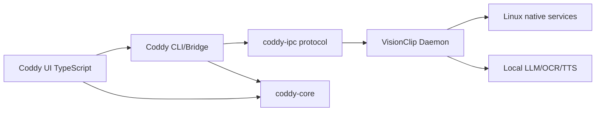

# Plano de Desacoplamento do Coddy

Este documento define como mover o Coddy para um repositório próprio sem quebrar a integração com o VisionClip.

## Objetivo

O Coddy deve poder evoluir como produto independente, com CLI, REPL, UI e contratos próprios, enquanto o VisionClip continua oferecendo recursos nativos de captura de tela, OCR, busca, TTS, abertura de aplicativos e integração Linux.

O desacoplamento deve preservar:

- protocolo estável entre processos;
- baixo acoplamento entre crates;
- testes de contrato compartilhados;
- capacidade de rodar Coddy e VisionClip no mesmo host;
- evolução independente de UI e backend.

## Fronteiras Propostas

| Camada | Dono futuro | Responsabilidade |
| --- | --- | --- |
| `coddy-core` | Repositório Coddy | Tipos de sessão, comandos, eventos, reducer, intents e contratos de UI. |
| `apps/coddy` | Repositório Coddy | CLI, atalhos, overlay de voz, sessão REPL e cliente IPC. |
| `apps/coddy-desktop` ou UI TS | Repositório Coddy | Terminal flutuante, desktop app, microfone e renderer. |
| `visionclip-voice-input` | Repositório Coddy ou crate compartilhada | Captura/transcrição de voz local com `VoiceInputConfig` neutro. |
| `visionclip-common` | Repositório VisionClip | Configuração VisionClip, transporte IPC atual e jobs nativos. |
| `visionclip-daemon` | Repositório VisionClip | Execução local: screenshot, OCR, LLM, busca, TTS e ações Linux. |
| protocolo `coddy-ipc` | Compartilhado/versionado | Mensagens estáveis entre Coddy e daemon. |

## Estado Atual

Hoje o monorepo já tem uma separação parcial:

- `crates/coddy-core` concentra modelos de domínio do REPL.
- `crates/coddy-ipc` iniciou a extração dos contratos de transporte do Coddy.
- `crates/coddy-client` centraliza o acesso ao daemon por Unix socket.
- `apps/coddy` é um cliente CLI separado do binário `visionclip`.
- `visionclip-daemon` executa ações e mantém o runtime de eventos.
- `ReplEventBroker` separa histórico de eventos, replay e publicação ao vivo.
- `coddy session snapshot`, `coddy session events` e `coddy session watch` formam o contrato operacional para a UI.
- `apps/coddy` usa `CoddyRuntimeConfig` e não importa `visionclip-common`.
- `visionclip-voice-input` usa `VoiceInputConfig` neutro, sem depender de configuração VisionClip.

O maior acoplamento restante é que `visionclip-common` ainda reexporta tipos de `coddy-core`/`coddy-ipc` para compatibilidade interna do daemon e de clientes legados.

## Arquitetura Alvo



Regra central: Coddy conhece o protocolo, não a implementação interna do VisionClip. VisionClip conhece o protocolo, não a UI do Coddy.

## Pacotes Recomendados

### Repositório Coddy

```text
coddy/
  apps/
    coddy/
    coddy-desktop/
  crates/
    coddy-core/
    coddy-ipc/
    coddy-client/
  docs/
```

### Repositório VisionClip

```text
visionclip/
  apps/
    visionclip/
    visionclip-daemon/
    visionclip-config/
  crates/
    common/
    infer/
    output/
    tts/
    voice-input/
  docs/
```

## Crate `coddy-ipc`

Para facilitar a migração, os contratos compartilhados do Coddy devem continuar sendo extraídos para uma crate neutra.

Responsabilidades:

- `ReplCommandJob`;
- `ReplSessionSnapshotJob`;
- `ReplEventsJob`;
- `ReplEventStreamJob`;
- enum de requests do Coddy;
- enum de resultados do Coddy;
- framing bincode ou outro codec estável;
- versionamento do protocolo.

O VisionClip pode manter jobs próprios em `visionclip-common`, mas os jobs do Coddy devem ficar em `coddy-ipc`.

Status atual:

- `ReplCommandJob`, `ReplSessionSnapshotJob`, `ReplEventsJob` e `ReplEventStreamJob` já estão em `coddy-ipc`.
- `CODDY_PROTOCOL_VERSION` e `CoddyEnvelope<T>` já existem como base para compatibilidade futura.
- `CoddyRequest` e `CoddyResult` já existem em `coddy-ipc`.
- `CoddyWireRequest` e `CoddyWireResult` já carregam magic `CDDY` e versão do protocolo no transporte direto.
- `decode_wire_request_payload` e `decode_wire_result_payload` centralizam a detecção do envelope direto.
- `read_frame` e `write_frame` já centralizam o framing bincode genérico.
- `VisionRequest` e `JobResult` ainda existem em `visionclip-common` como protocolo legado do daemon VisionClip, mas não são mais usados pelo `coddy-client`.

## Crate `coddy-client`

`coddy-client` é a camada que o CLI e a futura UI devem usar para falar com o daemon.

Responsabilidades atuais:

- abrir conexão Unix socket;
- enviar comandos REPL;
- buscar snapshot;
- buscar eventos incrementais;
- abrir stream de eventos;
- expor `CoddyResult` para o CLI;
- esconder `VisionRequest`/`JobResult` do CLI;
- falar com o daemon diretamente em `CoddyRequest`/`CoddyResult`.

Responsabilidades futuras:

- validar `CODDY_PROTOCOL_VERSION`;
- aplicar timeouts e retry;
- suportar transports alternativos, como Tauri command, HTTP local ou SSE;
- ser movida junto com o Coddy para o novo repositório.

## Versionamento de Protocolo

Adicionar versão explícita antes da separação:

```rust
pub const CODDY_PROTOCOL_VERSION: u16 = 1;

pub struct CoddyEnvelope<T> {
    pub protocol_version: u16,
    pub payload: T,
}
```

Política:

- mudanças compatíveis incrementam minor/patch no crate;
- mudanças incompatíveis incrementam `protocol_version`;
- daemon deve rejeitar versão incompatível com erro estruturado;
- CLI deve mostrar erro claro quando daemon e cliente estiverem desalinhados.

## Transporte

Curto prazo:

- Unix socket local;
- framing bincode atual;
- `ReplEventStream` persistente para stream de eventos.

Médio prazo:

- `coddy-client` abstrai transporte;
- suporte a Unix socket, Tauri command e HTTP local;
- testes de contrato devem rodar contra transporte fake e transporte real.

Longo prazo:

- bridge HTTP/SSE ou WebSocket opcional;
- autenticação local quando houver porta TCP;
- schemas OpenAPI gerados a partir dos tipos ou validados contra eles.

## Sequência de Migração

1. Congelar os contratos REPL atuais com testes de serialização.
2. Criar `crates/coddy-ipc` dentro do monorepo atual.
3. Mover apenas tipos Coddy de `visionclip-common::ipc` para `coddy-ipc`.
4. Atualizar `apps/coddy` para depender de `coddy-ipc` e de um `coddy-client`.
5. Atualizar `visionclip-daemon` para implementar o servidor do protocolo `coddy-ipc`.
6. Manter `visionclip-common` apenas para contratos do VisionClip.
7. Publicar ou referenciar `coddy-core`, `coddy-ipc` e `coddy-client` por Git/path no novo repositório Coddy.
8. Mover `apps/coddy` e UI para o repositório Coddy.
9. Manter testes de compatibilidade nos dois repositórios.

## Critérios de Aceite Para Separar o Repo

- `apps/coddy` não importa `visionclip-common`.
- `coddy-core` não importa crates VisionClip.
- `coddy-ipc` não importa crates VisionClip.
- `visionclip-daemon` compila usando `coddy-core` e `coddy-ipc` como dependências externas ou path dependencies.
- `coddy session snapshot`, `events`, `watch`, `ask` e `voice` funcionam contra o daemon.
- Testes de bincode garantem tags/formatos estáveis.
- Documentação de instalação indica como apontar o Coddy para o socket do VisionClip.

## Riscos e Mitigações

| Risco | Mitigação |
| --- | --- |
| Divergência entre cliente e daemon | `CODDY_PROTOCOL_VERSION` e erro de incompatibilidade. |
| Regressão silenciosa no bincode | Testes de roundtrip e tags estáveis. |
| Duplicação de configuração | `coddy-client` lê só socket/env necessários; VisionClip mantém config nativa. |
| UI depender de detalhes do daemon | UI consome snapshot + eventos, nunca estado interno. |
| Migração grande demais | Extrair primeiro `coddy-ipc`, depois mover repositório. |

## Próximo Incremento Recomendado

Criar testes de contrato cross-repo para `CoddyWireRequest`/`CoddyWireResult` e documentar as variáveis `CODDY_CONFIG` e `CODDY_DAEMON_SOCKET`. Isso permite mover o Coddy para outro repositório sem depender da árvore do VisionClip, mantendo apenas o socket local como fronteira operacional.
